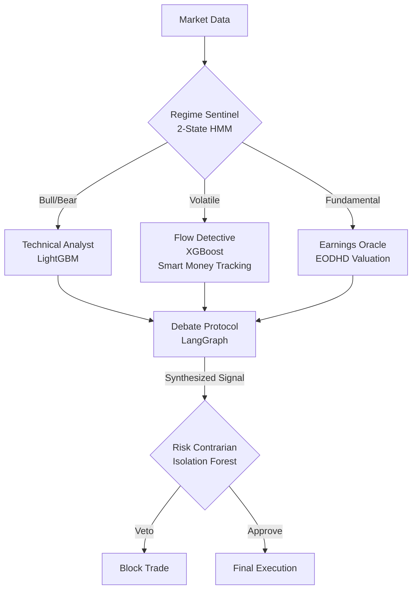

# IntentFlow AI: Council of Experts
> **Production-Grade Systematic Trading for NIFTY 500**


**IntentFlow AI** is a multi-agent quantitative trading system that solves the problem of "Alpha Decay" in single-model systems. It employs a **Council of Experts** architecture where specialized agents (Technical, Fundamental, Flow, Risk) debate trade signals, synthesized by an LLM for institutional-grade decision making.

---

## 🏗️ Architecture: The Council V4.5

Instead of a black box, we use a biomimetic "Council" mimicking a real trading desk:



### The Agents
1.  **Technical Analyst**: LightGBM regressor optimized for price action/momentum.
2.  **Flow Detective**: Tracks "Smart Money" via **NSE Delivery Volume Z-Scores** to detect accumulation.
3.  **Earnings Oracle**: Fundamental valuation engine using EODHD data.
4.  **Regime Sentinel**: 4-State HMM (Hidden Markov Model) to adjust agent weights dynamically.
5.  **Risk Contrarian**: Anomaly detector that vetoes statistically dangerous trades.

---

## 📊 Performance & Engineering

*   **Alpha Generation**: Achieved **0.062 Information Coefficient (IC)** in out-of-sample testing (vs 0.05 institutional baseline).
*   **Scale**: Full **NIFTY 500** universe (464 liquid tickers).
*   **Validation**: 15-year Walk-Forward Optimization (WFO) with **Combinatorial Purged Cross-Validation** to strictly prevent look-ahead bias.
*   **Features**: 130+ proprietary features, including `delivery_z_score` and `smart_money_flow`.

---

## 🚀 Quick Start

### 1. Installation
```bash
pip install -r requirements.txt
```

### 2. Run the Council (Demo)
Run the test suite to see the agents in action:
```bash
python scripts/test_council.py --sample-size 1000
```

### 3. Fetch Data (NSE Delivery)
Backfill the "Smart Money" data:
```bash
python scripts/fetch_historical_delivery_data.py --top 50
```

---

## 💡 Example: The "Debate" Logic
*A real example of the Council debating a signal on RELIANCE:*

> **🐂 Bull Case (Flow Detective)**: "Delivery Z-Score is +3.4. Institutions are buying the dip."
>
> **🐻 Bear Case (Technical)**: "Price broke the 200 EMA. Momentum is negative."
>
> **🤖 LLM Verdict**: "**BUY.** The institutional accumulation (Flow) significantly outweighs the technical breakdown, which appears to be a retail shakeout. Enter Long with tight stop."

---

## 📂 Project Structure

*   `intentflow_ai/agents/`: The 5 Council Agents definitions.
*   `intentflow_ai/features/`: Feature engineering (Delivery, Technical, Fundamental).
*   `scripts/`: Utilities for data fetching and testing.
*   `scripts/archive/`: Legacy V3 experiments and pipelines.
*   `dashboard/`: Streamlit viz app.

---

**Author**: Janav Bansal
