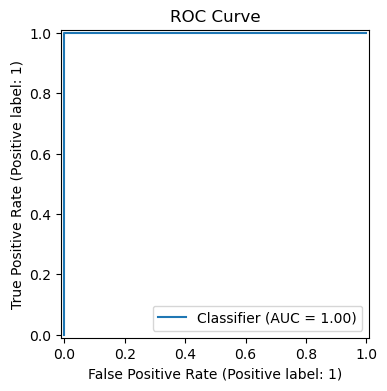
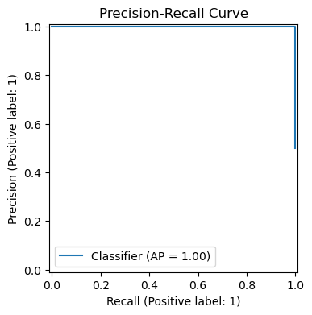
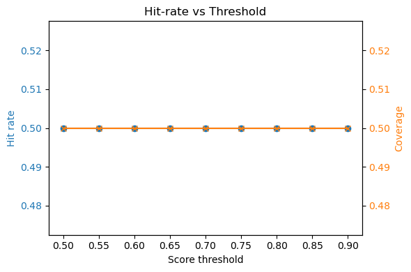

# Experiment v_universe

## Split Metrics
| Split | ROC AUC | PR AUC | P@10 | Daily P@10 | IC | Rank IC |
| --- | --- | --- | --- | --- | --- | --- |
| train | 1.000 | 1.000 | 1.000 | 0.500 | 1.000 | 0.866 |
| valid | 1.000 | 1.000 | 0.500 | 0.500 | 1.000 | 1.000 |
| test | 1.000 | 1.000 | 0.800 | 0.500 | 1.000 | 0.868 |
| overall | 1.000 | 1.000 | 1.000 | 0.500 | 0.999 | 0.866 |

## Diagnostics

## Backtest Summary
- **CAGR**: 12.241
- **Sharpe**: 31.493
- **maxDD**: 0.000
- **turnover**: 1.600
- **win_rate**: 0.500
- **avg_hold_days**: 10.000
- **cost_model**: {'name': 'realistic', 'components': {'brokerage_bps': 5.0, 'stt_bps': 10.0, 'stamp_duty_bps': 5.0, 'exchange_charges_bps': 2.0, 'sebi_turnover_bps': 0.5, 'gst_bps': 3.6}, 'total_bps': 26.1, 'description': 'Approximates Indian equities round-trip costs (brokerage, statutory taxes, exchange fees, and GST). Numbers are expressed in basis points per trade leg and tuned for liquid NIFTY 200 names.\n', 'source': '/Users/janavbansal/Desktop/IntentFlowAI/config/costs_india.yaml'}
