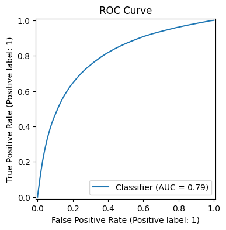
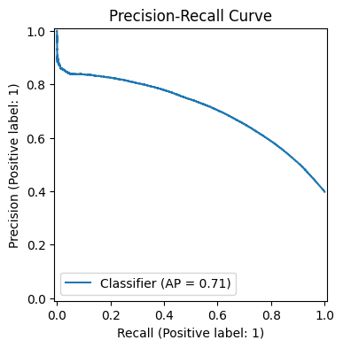
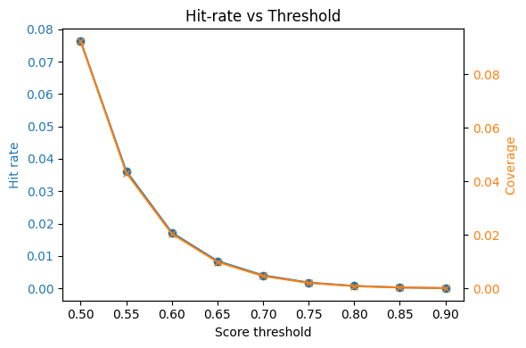
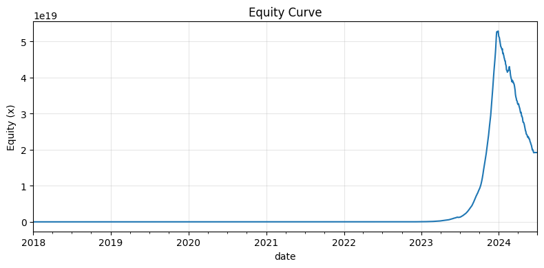
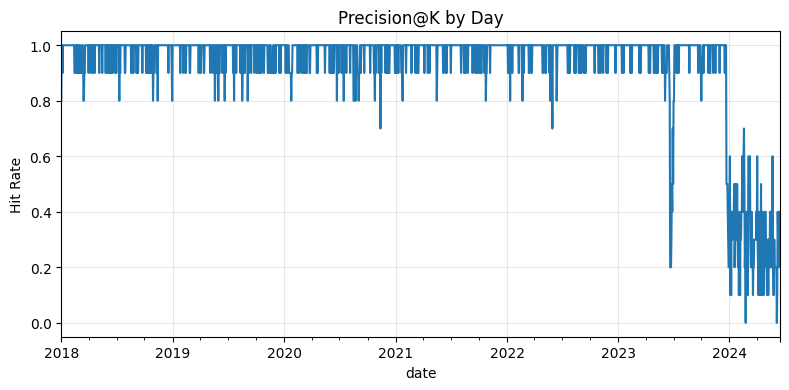
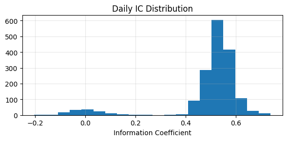

# Sanity Report — v_universe_sanity

## Headline Metrics
- **Sharpe**: 34.368
- **MaxDD**: -0.638
- **AvgIC**: 0.498
- **AvgExposure**: 1.000
- **CapacityHint**: 100.000

- Training tickers: **200**

## Null-label Backtest
- Sharpe: 0.000
- IC: 0.002
- Rank IC: 0.003

## Cost Sweep (per-side bps)

| Model | Total bps | Sharpe | CAGR | MaxDD |
| --- | --- | --- | --- | --- |
| realistic | 26.1 | 0.000 | 0.000 | 0.000 |
| sweep_10bps | 10.0 | 0.000 | 0.000 | 0.000 |
| sweep_25bps | 25.0 | 0.000 | 0.000 | 0.000 |
| sweep_50bps | 50.0 | 0.000 | 0.000 | 0.000 |
| sweep_75bps | 75.0 | 0.000 | 0.000 | 0.000 |

## Diagnostics







## Raw Metrics JSON
```json
{
  "overall": {
    "roc_auc": 0.8687736189725423,
    "pr_auc": 0.7819659486597289,
    "precision_at_10": 1.0,
    "precision_at_20": 1.0,
    "hit_rate_0.6": 0.00713946587537092,
    "precision_by_day_at_10": 0.9243916913946588,
    "precision_by_day_at_20": 0.8991691394658753,
    "ic": 0.4977537000777805,
    "rank_ic": 0.528305088644624,
    "hit_curve": [
      {
        "threshold": 0.5,
        "hit_rate": 0.027516320474777447,
        "coverage": 0.028364985163204747
      },
      {
        "threshold": 0.55,
        "hit_rate": 0.01416320474777448,
        "coverage": 0.01442433234421365
      },
      {
        "threshold": 0.6,
        "hit_rate": 0.00713946587537092,
        "coverage": 0.007228486646884273
      },
      {
        "threshold": 0.65,
        "hit_rate": 0.0032967359050445105,
        "coverage": 0.003317507418397626
      },
      {
        "threshold": 0.7,
        "hit_rate": 0.0015074183976261128,
        "coverage": 0.001513353115727003
      },
      {
        "threshold": 0.75,
        "hit_rate": 0.0005934718100890207,
        "coverage": 0.0005934718100890207
      },
      {
        "threshold": 0.8,
        "hit_rate": 0.00017210682492581602,
        "coverage": 0.00017210682492581602
      },
      {
        "threshold": 0.85,
        "hit_rate": 2.967359050445104e-05,
        "coverage": 2.967359050445104e-05
      },
      {
        "threshold": 0.9,
        "hit_rate": 0.0,
        "coverage": 0.0
      }
    ],
    "horizon_days": 10.0,
    "hit_rate": 0.00713946587537092
  },
  "train": {
    "roc_auc": 0.8970051323697493,
    "pr_auc": 0.8261108313133109,
    "precision_at_10": 1.0,
    "precision_at_20": 1.0,
    "hit_rate_0.6": 0.00755781359495445,
    "precision_by_day_at_10": 0.9771548703573932,
    "precision_by_day_at_20": 0.9489838822704976,
    "ic": 0.5311011883298317,
    "rank_ic": 0.5691500467064075,
    "hit_curve": [
      {
        "threshold": 0.5,
        "hit_rate": 0.029194113524877364,
        "coverage": 0.029540995094604065
      },
      {
        "threshold": 0.55,
        "hit_rate": 0.014971969166082691,
        "coverage": 0.015045550105115628
      },
      {
        "threshold": 0.6,
        "hit_rate": 0.00755781359495445,
        "coverage": 0.0075648213034337775
      },
      {
        "threshold": 0.65,
        "hit_rate": 0.003475823405746321,
        "coverage": 0.003482831114225648
      },
      {
        "threshold": 0.7,
        "hit_rate": 0.0015872459705676245,
        "coverage": 0.001590749824807288
      },
      {
        "threshold": 0.75,
        "hit_rate": 0.0006201822004204625,
        "coverage": 0.0006201822004204625
      },
      {
        "threshold": 0.8,
        "hit_rate": 0.00017869656622284514,
        "coverage": 0.00017869656622284514
      },
      {
        "threshold": 0.85,
        "hit_rate": 3.50385423966363e-05,
        "coverage": 3.50385423966363e-05
      },
      {
        "threshold": 0.9,
        "hit_rate": 0.0,
        "coverage": 0.0
      }
    ],
    "horizon_days": 10.0,
    "hit_rate": 0.00755781359495445
  },
  "valid": {
    "roc_auc": 0.8988638020471543,
    "pr_auc": 0.8329343978767793,
    "precision_at_10": 1.0,
    "precision_at_20": 1.0,
    "hit_rate_0.6": 0.009758064516129032,
    "precision_by_day_at_10": 0.9814516129032259,
    "precision_by_day_at_20": 0.9620967741935483,
    "ic": 0.5388505387869422,
    "rank_ic": 0.572339418663959,
    "hit_curve": [
      {
        "threshold": 0.5,
        "hit_rate": 0.03504032258064516,
        "coverage": 0.03528225806451613
      },
      {
        "threshold": 0.55,
        "hit_rate": 0.01899193548387097,
        "coverage": 0.01907258064516129
      },
      {
        "threshold": 0.6,
        "hit_rate": 0.009758064516129032,
        "coverage": 0.009838709677419354
      },
      {
        "threshold": 0.65,
        "hit_rate": 0.00467741935483871,
        "coverage": 0.004717741935483871
      },
      {
        "threshold": 0.7,
        "hit_rate": 0.0021370967741935485,
        "coverage": 0.0021774193548387095
      },
      {
        "threshold": 0.75,
        "hit_rate": 0.0008870967741935484,
        "coverage": 0.0008870967741935484
      },
      {
        "threshold": 0.8,
        "hit_rate": 0.00028225806451612906,
        "coverage": 0.00028225806451612906
      },
      {
        "threshold": 0.85,
        "hit_rate": 0.0,
        "coverage": 0.0
      },
      {
        "threshold": 0.9,
        "hit_rate": 0.0,
        "coverage": 0.0
      }
    ],
    "horizon_days": 10.0,
    "hit_rate": 0.009758064516129032
  },
  "test": {
    "roc_auc": 0.4963337413548408,
    "pr_auc": 0.3098939647172312,
    "precision_at_10": 0.3,
    "precision_at_20": 0.3,
    "hit_rate_0.6": 0.0002916666666666667,
    "precision_by_day_at_10": 0.3008333333333333,
    "precision_by_day_at_20": 0.30375,
    "ic": -0.005617931363622522,
    "rank_ic": -0.0031174861694748027,
    "hit_curve": [
      {
        "threshold": 0.5,
        "hit_rate": 0.0026666666666666666,
        "coverage": 0.009791666666666667
      },
      {
        "threshold": 0.55,
        "hit_rate": 0.0010416666666666667,
        "coverage": 0.0037083333333333334
      },
      {
        "threshold": 0.6,
        "hit_rate": 0.0002916666666666667,
        "coverage": 0.001375
      },
      {
        "threshold": 0.65,
        "hit_rate": 0.000125,
        "coverage": 0.0002916666666666667
      },
      {
        "threshold": 0.7,
        "hit_rate": 8.333333333333333e-05,
        "coverage": 8.333333333333333e-05
      },
      {
        "threshold": 0.75,
        "hit_rate": 4.1666666666666665e-05,
        "coverage": 4.1666666666666665e-05
      },
      {
        "threshold": 0.8,
        "hit_rate": 0.0,
        "coverage": 0.0
      },
      {
        "threshold": 0.85,
        "hit_rate": 0.0,
        "coverage": 0.0
      },
      {
        "threshold": 0.9,
        "hit_rate": 0.0,
        "coverage": 0.0
      }
    ],
    "horizon_days": 10.0,
    "hit_rate": 0.0002916666666666667
  },
  "by_regime": {
    "bear": {
      "train": {
        "roc_auc": 0.9999998569753139,
        "pr_auc": 0.9999996997700238,
        "precision_at_10": 1.0,
        "precision_at_20": 1.0,
        "hit_rate_0.6": 0.32225,
        "precision_by_day_at_10": 1.0,
        "precision_by_day_at_20": 1.0,
        "ic": 0.7821016435652473,
        "rank_ic": 0.7596005036174565,
        "hit_curve": [
          {
            "threshold": 0.5,
            "hit_rate": 0.32225,
            "coverage": 0.32225
          },
          {
            "threshold": 0.55,
            "hit_rate": 0.32225,
            "coverage": 0.32225
          },
          {
            "threshold": 0.6,
            "hit_rate": 0.32225,
            "coverage": 0.32225
          },
          {
            "threshold": 0.65,
            "hit_rate": 0.32225,
            "coverage": 0.32225
          },
          {
            "threshold": 0.7,
            "hit_rate": 0.32225,
            "coverage": 0.32225
          },
          {
            "threshold": 0.75,
            "hit_rate": 0.32225,
            "coverage": 0.32225
          },
          {
            "threshold": 0.8,
            "hit_rate": 0.32125,
            "coverage": 0.32125
          },
          {
            "threshold": 0.85,
            "hit_rate": 0.31975,
            "coverage": 0.31975
          },
          {
            "threshold": 0.9,
            "hit_rate": 0.3155,
            "coverage": 0.3155
          }
        ],
        "horizon_days": 10.0,
        "hit_rate": 0.32225
      }
    },
    "bull": {
      "train": {
        "roc_auc": 0.8900562125952906,
        "pr_auc": 0.8166571780334333,
        "precision_at_10": 1.0,
        "precision_at_20": 1.0,
        "hit_rate_0.6": 0.005682302771855011,
        "precision_by_day_at_10": 0.977683013503909,
        "precision_by_day_at_20": 0.94317697228145,
        "ic": 0.5177712340678924,
        "rank_ic": 0.5572704786730829,
        "hit_curve": [
          {
            "threshold": 0.5,
            "hit_rate": 0.02388770433546553,
            "coverage": 0.024068941009239515
          },
          {
            "threshold": 0.55,
            "hit_rate": 0.011990049751243782,
            "coverage": 0.012014925373134328
          },
          {
            "threshold": 0.6,
            "hit_rate": 0.005682302771855011,
            "coverage": 0.005692963752665245
          },
          {
            "threshold": 0.65,
            "hit_rate": 0.0025550817341862117,
            "coverage": 0.0025550817341862117
          },
          {
            "threshold": 0.7,
            "hit_rate": 0.0011975835110163468,
            "coverage": 0.0011975835110163468
          },
          {
            "threshold": 0.75,
            "hit_rate": 0.0004193319118692253,
            "coverage": 0.0004193319118692253
          },
          {
            "threshold": 0.8,
            "hit_rate": 0.00015280739161336175,
            "coverage": 0.00015280739161336175
          },
          {
            "threshold": 0.85,
            "hit_rate": 2.8429282160625443e-05,
            "coverage": 2.8429282160625443e-05
          },
          {
            "threshold": 0.9,
            "hit_rate": 0.0,
            "coverage": 0.0
          }
        ],
        "horizon_days": 10.0,
        "hit_rate": 0.005682302771855011
      },
      "valid": {
        "roc_auc": 0.8946707352399201,
        "pr_auc": 0.8218416691234743,
        "precision_at_10": 1.0,
        "precision_at_20": 1.0,
        "hit_rate_0.6": 0.0067741935483870966,
        "precision_by_day_at_10": 0.978225806451613,
        "precision_by_day_at_20": 0.9431451612903226,
        "ic": 0.5258670841107558,
        "rank_ic": 0.5617569476212648,
        "hit_curve": [
          {
            "threshold": 0.5,
            "hit_rate": 0.028911290322580645,
            "coverage": 0.02903225806451613
          },
          {
            "threshold": 0.55,
            "hit_rate": 0.01439516129032258,
            "coverage": 0.014435483870967741
          },
          {
            "threshold": 0.6,
            "hit_rate": 0.0067741935483870966,
            "coverage": 0.0067741935483870966
          },
          {
            "threshold": 0.65,
            "hit_rate": 0.0032661290322580647,
            "coverage": 0.0032661290322580647
          },
          {
            "threshold": 0.7,
            "hit_rate": 0.0013306451612903226,
            "coverage": 0.0013306451612903226
          },
          {
            "threshold": 0.75,
            "hit_rate": 0.0003225806451612903,
            "coverage": 0.0003225806451612903
          },
          {
            "threshold": 0.8,
            "hit_rate": 0.0,
            "coverage": 0.0
          },
          {
            "threshold": 0.85,
            "hit_rate": 0.0,
            "coverage": 0.0
          },
          {
            "threshold": 0.9,
            "hit_rate": 0.0,
            "coverage": 0.0
          }
        ],
        "horizon_days": 10.0,
        "hit_rate": 0.0067741935483870966
      },
      "test": {
        "roc_auc": 0.9022283381590699,
        "pr_auc": 0.830899876256027,
        "precision_at_10": 1.0,
        "precision_at_20": 1.0,
        "hit_rate_0.6": 0.009041666666666667,
        "precision_by_day_at_10": 0.9800000000000001,
        "precision_by_day_at_20": 0.9474999999999999,
        "ic": 0.5386718293102997,
        "rank_ic": 0.5748682805805004,
        "hit_curve": [
          {
            "threshold": 0.5,
            "hit_rate": 0.03170833333333333,
            "coverage": 0.03191666666666667
          },
          {
            "threshold": 0.55,
            "hit_rate": 0.016708333333333332,
            "coverage": 0.016708333333333332
          },
          {
            "threshold": 0.6,
            "hit_rate": 0.009041666666666667,
            "coverage": 0.009041666666666667
          },
          {
            "threshold": 0.65,
            "hit_rate": 0.003875,
            "coverage": 0.003875
          },
          {
            "threshold": 0.7,
            "hit_rate": 0.0013333333333333333,
            "coverage": 0.0013333333333333333
          },
          {
            "threshold": 0.75,
            "hit_rate": 0.00025,
            "coverage": 0.00025
          },
          {
            "threshold": 0.8,
            "hit_rate": 4.1666666666666665e-05,
            "coverage": 4.1666666666666665e-05
          },
          {
            "threshold": 0.85,
            "hit_rate": 0.0,
            "coverage": 0.0
          },
          {
            "threshold": 0.9,
            "hit_rate": 0.0,
            "coverage": 0.0
          }
        ],
        "horizon_days": 10.0,
        "hit_rate": 0.009041666666666667
      }
    }
  },
  "purged_cv": [
    {
      "roc_auc": 0.4952503910061038,
      "pr_auc": 0.31470710686745684,
      "precision_at_10": 0.3,
      "precision_at_20": 0.3,
      "hit_rate_0.6": 0.0024153297682709446,
      "precision_by_day_at_10": 0.3151515151515152,
      "precision_by_day_at_20": 0.3131016042780749,
      "ic": -0.008316677461940489,
      "rank_ic": -0.010561328215216818,
      "hit_curve": [
        {
          "threshold": 0.5,
          "hit_rate": 0.01090909090909091,
          "coverage": 0.0347415329768271
        },
        {
          "threshold": 0.55,
          "hit_rate": 0.00517825311942959,
          "coverage": 0.01623885918003565
        },
        {
          "threshold": 0.6,
          "hit_rate": 0.0024153297682709446,
          "coverage": 0.007290552584670232
        },
        {
          "threshold": 0.65,
          "hit_rate": 0.0010606060606060607,
          "coverage": 0.003003565062388592
        },
        {
          "threshold": 0.7,
          "hit_rate": 0.00041889483065953655,
          "coverage": 0.0010962566844919786
        },
        {
          "threshold": 0.75,
          "hit_rate": 0.00013368983957219252,
          "coverage": 0.000409982174688057
        },
        {
          "threshold": 0.8,
          "hit_rate": 3.5650623885918004e-05,
          "coverage": 0.00014260249554367202
        },
        {
          "threshold": 0.85,
          "hit_rate": 8.912655971479501e-06,
          "coverage": 1.7825311942959002e-05
        },
        {
          "threshold": 0.9,
          "hit_rate": 0.0,
          "coverage": 0.0
        }
      ],
      "horizon_days": 10.0,
      "hit_rate": 0.0024153297682709446,
      "fold": 2
    },
    {
      "roc_auc": 0.49468390299400244,
      "pr_auc": 0.3131472776877757,
      "precision_at_10": 0.4,
      "precision_at_20": 0.35,
      "hit_rate_0.6": 0.0014653641207815276,
      "precision_by_day_at_10": 0.32309058614564834,
      "precision_by_day_at_20": 0.311190053285968,
      "ic": -0.005376954728368791,
      "rank_ic": -0.0071645148271070255,
      "hit_curve": [
        {
          "threshold": 0.5,
          "hit_rate": 0.006323268206039076,
          "coverage": 0.019387211367673178
        },
        {
          "threshold": 0.55,
          "hit_rate": 0.002975133214920071,
          "coverage": 0.008436944937833037
        },
        {
          "threshold": 0.6,
          "hit_rate": 0.0014653641207815276,
          "coverage": 0.0041207815275310835
        },
        {
          "threshold": 0.65,
          "hit_rate": 0.000674955595026643,
          "coverage": 0.00197158081705151
        },
        {
          "threshold": 0.7,
          "hit_rate": 0.0002486678507992895,
          "coverage": 0.0007637655417406749
        },
        {
          "threshold": 0.75,
          "hit_rate": 7.992895204262877e-05,
          "coverage": 0.00023978685612788633
        },
        {
          "threshold": 0.8,
          "hit_rate": 3.552397868561279e-05,
          "coverage": 8.880994671403197e-05
        },
        {
          "threshold": 0.85,
          "hit_rate": 8.880994671403197e-06,
          "coverage": 1.7761989342806394e-05
        },
        {
          "threshold": 0.9,
          "hit_rate": 0.0,
          "coverage": 0.0
        }
      ],
      "horizon_days": 10.0,
      "hit_rate": 0.0014653641207815276,
      "fold": 3
    }
  ],
  "plots": {
    "roc_curve": "plots/roc_curve.png",
    "precision_recall_curve": "plots/precision_recall_curve.png",
    "hit_rate_curve": "plots/hit_rate_curve.png"
  }
}
```